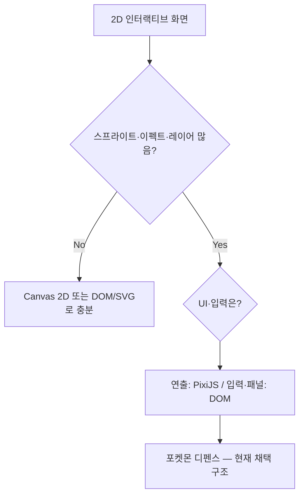

# Canvas vs PixiJS — 언제 Pixi를 고려할까?

포켓몬 디펜스(`js/gameDemo.js`) 세미나 발표용 정리입니다.  
Canvas 2D만으로 만들었다면 부담이 컸을 연출 영역과, **PixiJS 도입을 검토해볼 만한 조건**을 정리합니다.

관련 문서: [`pixi-vs-canvas.md`](pixi-vs-canvas.md) · [`game-mechanics.md`](game-mechanics.md)

---

## 5. 이럴 때 Canvas 대신 PixiJS를 고려해볼 만하다

아래 항목 중 **3개 이상** 해당하면, Canvas 2D 단독보다 **PixiJS(또는 Phaser 등 WebGL 기반 2D 엔진)** 검토를 추천합니다.

| # | 조건 | 우리 프로젝트 예 |
|---|------|------------------|
| 1 | **스프라이트가 많다** — 같은 이미지를 여러 번 그림 | 타워·적 PokeAPI PNG, `textureCache` + `PIXI.Sprite` |
| 2 | **레이어·겹침(z-order)이 복잡하다** | `gridLayer` → `unitLayer` → `enemyLayer` → `fxLayer` → `uiLayer` |
| 3 | **짧은 애니·파티클이 많다** — spawn/destroy가 반복됨 | 빔, 탄환, 폭발, `AnimatedSprite` GIF 공격 |
| 4 | **클리핑·마스크가 필요하다** | 버프 오라 — `auraLayer.mask = fieldMaskGfx` (10×10 말판 밖 잘림) |
| 5 | **60fps 게임 루프** — delta 기반 이동·이펙트가 매 프레임 | `app.ticker` → `onTick()`, `updateProjectiles`, `updateEffects` |

### Pixi가 특히 줄여주는 일 (Canvas였다면 직접 구현)

- **디스플레이 트리** — Container 자식으로 HP바·보스 링·스프라이트 묶기, `x/y`만 갱신
- **텍스처 파이프라인** — `PIXI.Assets.load` + 캐시, GPU 텍스처 재사용
- **객체 생명주기** — `destroy()`, `destroyed` 체크로 이펙트·유닛 제거 시 리소스 정리
- **Retina** — `Application`의 `resolution`, `autoDensity`

### Pixi까지 안 가도 되는 경우

- 정적 차트·단순 그림 **한 장** 수준
- 클릭 영역이 적고 **DOM / SVG**로 충분
- 그리기 순서가 거의 고정이고 **이펙트·애니가 거의 없음**
- **번들 크기**를 반드시 최소화해야 하는 임베드 환경 (Pixi `pixi.min.js` 부담)

### 우리 프로젝트에서 Pixi를 쓰지 않은 부분 (균형)

| 기능 | 선택 | 이유 |
|------|------|------|
| 타워 클릭·드래그 | DOM `grid-overlay` | 셀 단위 hit test, CSS `tower-selected` — HTML이 더 단순 |
| 강화 패널·뽑기·보관함 | jQuery DOM | 폼·버튼·텍스트 UI |
| 합성 조건·스탯 계산 | 순수 JavaScript | 렌더러와 무관 |

> **한 줄:** 게임 **로직**은 Canvas와 Pixi가 같고, **연출·레이어·이펙트·리소스 관리**가 많아질수록 Pixi 이득이 커진다.

---

## 6. 우리 프로젝트 판단 요약

### 의사결정 흐름

### 채택 구조 요약

| 영역 | 기술 | 담당 |
|------|------|------|
| 전투 필드 렌더링 | **PixiJS** | 스프라이트, 투사체, 이펙트, 오라, 사거리 원 |
| 말판 입력 | **DOM + jQuery** | 10×10 그리드, 드래그·클릭 |
| HUD | **DOM** | 뽑기, 타워 강화 패널, 보관함 |

### 발표용 결론 (2문장)

1. **타워 선택·합성·스탯** 같은 게임 로직은 Canvas든 Pixi든 거의 동일하다.
2. **스프라이트·레이어·이펙트·GIF·destroy**가 많아지는 TD·액션형 2D 게임이면 Canvas만 고집하기보다 **PixiJS + DOM 하이브리드**를 검토할 만하다.

---
